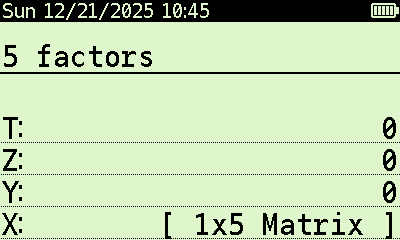
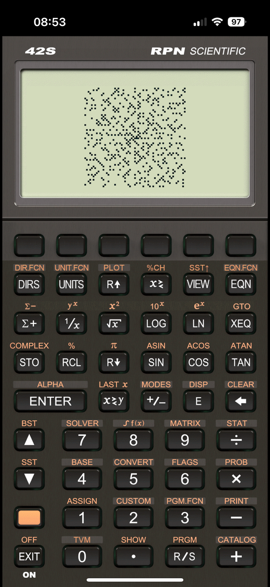

# Primes

Programs related to prime numbers.

## Prime

Determines if an integer x greater than one is prime. Displays the result in the alpha register.

Algorithm:
1. Check if x mod 2 == 0.
2. Check if x mod 3 == 0.
3. Loop for i = 5 .. sqrt(x):
   - Check if x mod i == 0.
   - Check if x mod (i + 2) == 0.
4. If all checks above fail, x is prime.

## Factr

Factorization of an integer x greater than one. Stores the unique factors in a matrix on
X. Displays a message in the alpha register indicating the number of unique factors, or
that the number is prime.

Screenshot:

## Ulam

Draws an Ulam spiral. See https://en.wikipedia.org/wiki/Ulam_spiral .
Enter the number of segments in register X, for example 100.
Remember to adjust the resolution for your own device.

Screenshot on DM42n with input = 400:

Screenshot on Free42 iPhone app:

## NextP

Given a number, return the next prime.

## Sieve

Given a limit > 2, creates a matrix containing all primes in the range from 2 to the limit.
Uses the Sieve of Eratosthenes algorithm, and switches to the segmented version if the limit
is too high in order to save registers.
